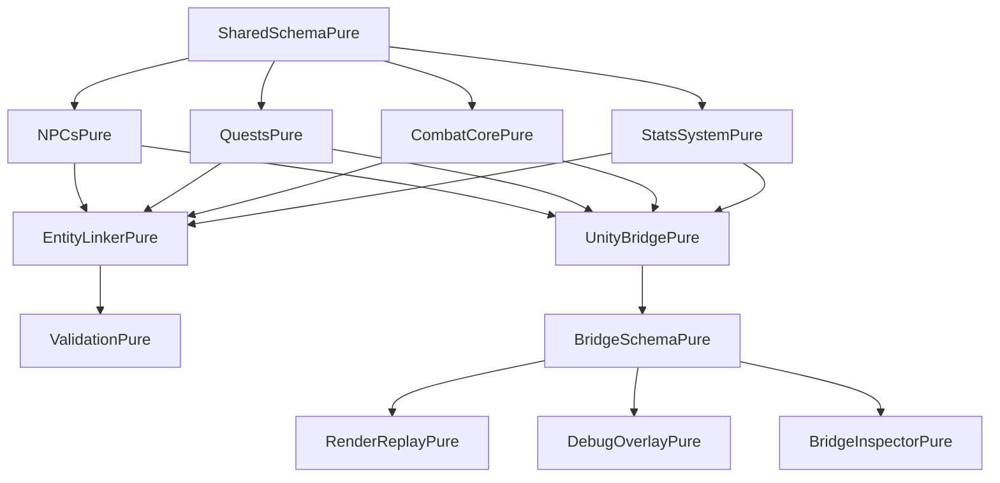

# 🧩 Modularity Architecture

MIFF is built on a foundation of modularity that enables contributors to understand, modify, and extend the framework with confidence. This guide explains the core modular design principles that make MIFF remix-safe and engine-agnostic.

## 🏗️ Core Design Principles

### **1. Pure Logic Separation**

MIFF separates pure game logic from engine-specific rendering. This creates a clear boundary between what the game *does* and how it *looks*.

```typescript
// Pure logic - works everywhere
export class NPCsManager {
  createNPC(data: NPCCreateData): NPC {
    const npc = {
      id: generateId(),
      name: data.name,
      stats: data.stats,
      position: data.position
    };
    
    this.npcs.set(npc.id, npc);
    this.emit('npcCreated', npc);
    return npc;
  }
}

// Engine-specific rendering (in bridge)
export class UnityBridge {
  render(type: string, data: any): UnityRenderData {
    switch (type) {
      case 'npc':
        return this.renderNPC(data);
      case 'quest':
        return this.renderQuest(data);
    }
  }
}
```

### **2. CLI-First Interface**

Every module exposes its functionality through command-line interfaces, making automation and testing seamless.

```bash
# Pure logic operations
npx ts-node NPCsPure/cliHarness.ts create --name "Guard" --stats '{"health": 100}'

# Bridge rendering operations
npx ts-node UnityBridgePure/cliHarness.ts render --type npc --data npc_data.json
```

### **3. Schema Versioning**

Strict schema versioning ensures compatibility and safe evolution:

```typescript
// Schema version declaration
export const SCHEMA_VERSION = 'v13';

// Type-safe data structures
export interface NPC {
  id: string;
  name: string;
  stats: StatBlock;  // Versioned type
  position?: Position;
  metadata?: Record<string, any>;
}
```

## 📦 Module Categories

### **Pure Logic Modules**

These contain the core game mechanics without any engine dependencies:

#### **Phase 1: Core Gameplay**
- **StatsSystemPure**: Character statistics and progression
- **CombatCorePure**: Turn-based and real-time combat
- **QuestsPure**: Quest management and progression
- **NPCsPure**: Non-player character systems
- **StatusEffectsPure**: Buff/debuff management
- **PathfindingPure**: Movement and navigation

#### **Phase 2: Interop & Validation**
- **SharedSchemaPure**: Common types and interfaces
- **EntityLinkerPure**: Cross-module reference resolution
- **ValidationPure**: Data consistency validation

#### **Phase 3: Derived Systems**
- **CraftingPure**: Recipe-based crafting
- **LootTablesPure**: Randomized loot generation
- **EconomyPure**: In-game economy and trading

#### **Phase 4: Scenario Packs**
- **TutorialScenarioPure**: Learning scenarios
- **QuestScenarioPure**: Story-driven scenarios
- **CombatScenarioPure**: Arena-style scenarios

### **Bridge Modules**

These adapt pure logic for specific engines:

#### **Phase 6: Engine Bridges**
- **UnityBridgePure**: Unity MonoBehaviour and ECS
- **WebBridgePure**: Phaser.js and Canvas
- **GodotBridgePure**: GDScript and C#
- **BridgeSchemaPure**: Unified renderData schema

### **Tool Modules**

These provide utilities for development and debugging:

#### **Phase 5: CLI Tools**
- **miff-simulate**: Scenario simulation
- **miff-diff**: Output comparison
- **miff-init**: Project scaffolding

#### **Phase 7: Visual Tools**
- **RenderReplayPure**: Visual replay and debugging
- **DebugOverlayPure**: Real-time debug overlay
- **BridgeInspectorPure**: Bridge validation

## 🔗 Module Dependencies

### **Dependency Graph**



### **Dependency Rules**

1. **Pure modules** can only depend on other pure modules
2. **Bridge modules** can depend on pure modules and BridgeSchemaPure
3. **Tool modules** can depend on any module
4. **No circular dependencies** are allowed
5. **Schema versions** must be compatible across dependencies

## 🎯 Module Structure

Every MIFF module follows a consistent structure:

```
ModuleNamePure/
├── Manager.ts              # Core business logic
├── cliHarness.ts           # Command-line interface
├── sample_*.json           # Example data
├── expected_output.json    # Golden test targets
├── tests/
│   └── goldenModule.test.ts # Deterministic tests
└── README.md               # Documentation
```

### **Manager.ts Pattern**

```typescript
export class ModuleManager {
  private data: Map<string, any> = new Map();
  private events: EventEmitter = new EventEmitter();
  
  constructor(config?: ModuleConfig) {
    // Initialize with configuration
  }
  
  // Core operations
  create(data: CreateData): Result {
    // Implementation
  }
  
  update(id: string, data: UpdateData): Result {
    // Implementation
  }
  
  delete(id: string): Result {
    // Implementation
  }
  
  list(): Result {
    // Implementation
  }
  
  // Event handling
  on(event: string, handler: Function): void {
    this.events.on(event, handler);
  }
  
  emit(event: string, data: any): void {
    this.events.emit(event, data);
  }
}
```

### **CLI Harness Pattern**

```typescript
#!/usr/bin/env npx ts-node

import { ModuleManager } from '../../miff/pure/cliHarness.ts <command> [options]

Commands:
  create    Create a new item
  update    Update an existing item
  delete    Delete an item
  list      List all items
  dump      Dump all data

Options:
  --help    Show this help message
  --verbose Enable verbose output
  --format  Output format (json, pretty)
  `);
}

function main(): void {
  const args = process.argv.slice(2);
  const command = args[0];
  
  switch (command) {
    case 'create':
      // Handle create command
      break;
    case 'list':
      // Handle list command
      break;
    default:
      printUsage();
  }
}

if (require.main === module) {
  main();
}
```

## 🔄 Remix Safety

### **Configuration-Driven Behavior**

Modules accept configuration to customize behavior:

```typescript
export interface ModuleConfig {
  // Core settings
  schemaVersion: string;
  strictMode: boolean;
  
  // Customization hooks
  onBeforeCreate?: (data: any) => any;
  onAfterCreate?: (result: any) => void;
  onError?: (error: Error) => void;
  
  // Validation rules
  validationRules?: ValidationRule[];
  
  // Event handlers
  eventHandlers?: Record<string, Function>;
}
```

### **Event System**

Modules emit events for extensibility:

```typescript
// Standard events
manager.on('itemCreated', (item) => {
  console.log('Item created:', item);
});

manager.on('itemUpdated', (item) => {
  console.log('Item updated:', item);
});

manager.on('itemDeleted', (id) => {
  console.log('Item deleted:', id);
});

// Custom events
manager.on('customEvent', (data) => {
  // Handle custom event
});
```

### **Extension Points**

Modules provide clear extension points:

```typescript
// Extend manager behavior
export class CustomModuleManager extends ModuleManager {
  constructor(config: CustomConfig) {
    super(config);
    
    // Add custom initialization
    this.setupCustomFeatures();
  }
  
  private setupCustomFeatures(): void {
    // Custom logic
  }
  
  // Override methods safely
  create(data: CreateData): Result {
    // Pre-processing
    const processedData = this.preProcess(data);
    
    // Call parent method
    const result = super.create(processedData);
    
    // Post-processing
    this.postProcess(result);
    
    return result;
  }
}
```

## 🧪 Testing Strategy

### **Golden Tests**

Every module includes deterministic golden tests:

```typescript
describe('ModuleNamePure Golden Tests', () => {
  test('create operation', () => {
    const output = execFileSync('npx', [
      'ts-node', 'ModuleNamePure/cliHarness.ts', 'create', '--name', 'Test'
    ], { encoding: 'utf-8' });
    
    const result = JSON.parse(output);
    expect(result.op).toBe('create');
    expect(result.status).toBe('ok');
  });
});
```

### **Integration Tests**

Modules are tested together:

```typescript
describe('Module Integration Tests', () => {
  test('NPCsPure + QuestsPure integration', () => {
    // Test cross-module functionality
  });
});
```

## 🔧 Development Workflow

### **Creating a New Module**

1. **Scaffold the structure**:
   ```bash
   npx ts-node cli/miff-init.ts my-module --template pure
   ```

2. **Implement the Manager**:
   ```typescript
   export class MyModuleManager {
     // Core logic implementation
   }
   ```

3. **Create the CLI harness**:
   ```typescript
   // Command-line interface
   ```

4. **Add golden tests**:
   ```typescript
   // Deterministic test cases
   ```

5. **Document the module**:
   ```markdown
   # Module documentation with remix hooks
   ```

### **Modifying Existing Modules**

1. **Check dependencies**:
   ```bash
   npm run check-deps
   ```

2. **Run golden tests**:
   ```bash
   npm test -- --testNamePattern="ModuleName"
   ```

3. **Validate schema compatibility**:
   ```bash
   npm run validate-schemas
   ```

4. **Test with bridges**:
   ```bash
   npm run test-bridges
   ```

## 🎯 Best Practices

### **1. Keep Modules Focused**

Each module should have a single, well-defined responsibility:

```typescript
// Good: Focused module
export class NPCsManager {
  // Only NPC-related functionality
}

// Avoid: Mixed responsibilities
export class GameManager {
  // NPCs, Quests, Combat, etc. - too broad
}
```

### **2. Use Type Safety**

Leverage TypeScript for compile-time safety:

```typescript
// Good: Type-safe interfaces
export interface NPCCreateData {
  name: string;
  stats: StatBlock;
  position?: Position;
}

// Avoid: Any types
export function createNPC(data: any): any {
  // No type safety
}
```

### **3. Emit Events for Extensibility**

Use events to enable customization:

```typescript
// Good: Event-driven design
this.emit('npcCreated', npc);

// Avoid: Tight coupling
this.customHandler(npc); // Hard to extend
```

### **4. Validate Inputs**

Always validate module inputs:

```typescript
// Good: Input validation
createNPC(data: NPCCreateData): NPC {
  if (!data.name || data.name.trim() === '') {
    throw new Error('NPC name is required');
  }
  
  // Continue with creation
}

// Avoid: No validation
createNPC(data: any): NPC {
  // Assume data is valid
}
```

## 🔗 Integration Examples

### **Cross-Module Communication**

```typescript
// NPCsPure depends on SharedSchemaPure
import { EntityID, StatBlock } from '../../miff/pure/Manager';

export interface NPC {
  id: EntityID;
  name: string;
  stats: StatBlock;
}

// QuestsPure depends on NPCsPure
import { NPC } from '../../miff/pure/Manager';

export interface Quest {
  id: string;
  title: string;
  npcRefs: EntityID[]; // References to NPCs
}
```

### **Bridge Integration**

```typescript
// UnityBridgePure depends on NPCsPure
import { NPCsManager } from '../../miff/pure/Manager';

export class UnityBridge {
  private npcManager = new NPCsManager();
  
  renderNPC(npc: NPC): UnityRenderData {
    return {
      type: 'GameObject',
      components: [
        { type: 'Transform', position: npc.position },
        { type: 'NPCController', data: npc }
      ]
    };
  }
}
```

## 🎉 Summary

MIFF's modular architecture provides:

- **Clear separation** between pure logic and engine-specific code
- **CLI-first design** for automation and testing
- **Schema versioning** for safe evolution
- **Event-driven extensibility** for customization
- **Golden test coverage** for deterministic validation
- **Type safety** throughout the system

This modular design enables contributors to understand, modify, and extend MIFF with confidence, knowing that changes are isolated and testable.

---

*Ready to explore how modules work with engines? Check out the [Engine Agnostic](/architecture/engine-agnostic) guide!* 🚀